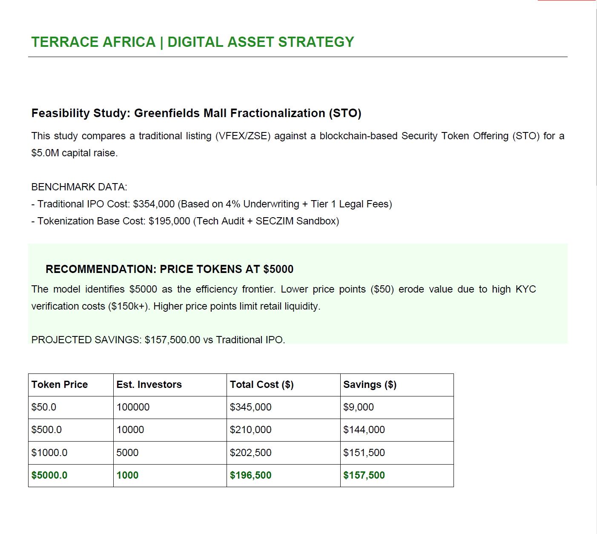
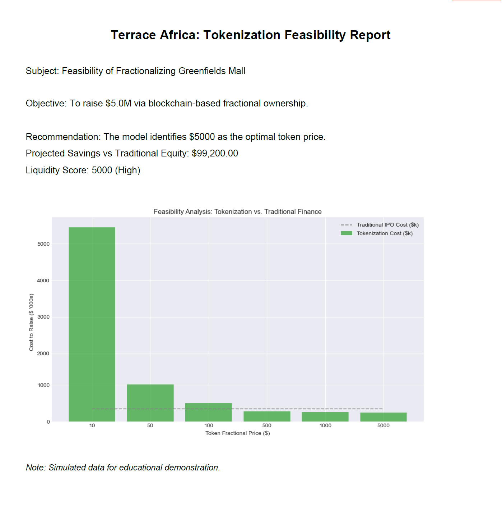

# 🏗️ Terrace Africa: Real Estate Tokenization Feasibility Model

### *Quantifying the "Cost of Capital" Advantage in Blockchain Fractionalization*


---

## 📖 Project Overview
This project explores a strategic alternative to traditional capital raising for **Terrace Africa's Greenfields Retail Centre**.

Using a Python-based financial simulation, I modeled the unit economics of a **$5.0M Security Token Offering (STO)** versus a traditional **Equity Listing (IPO)** on the Victoria Falls Stock Exchange (VFEX). The tool generates automated "Board-Ready" PDF reports that identify the exact "efficiency frontier"—the optimal token price that balances retail liquidity with regulatory compliance costs.

### 🎯 Key Objectives
* **Cost Benchmarking:** Comparative analysis of Underwriting/Legal Fees (Traditional) vs. Smart Contract/KYC Costs (Blockchain).
* **Liquidity Modeling:** Simulating retail investor demand elasticity at different price points ($50 vs $5,000).
* **Automated Reporting:** Programmatic generation of feasibility studies using `FPDF`.

---

## 📊 Visuals & Outputs

### The "Sweet Spot" Analysis
*The model identified that issuing tokens at **$5,000** saves ~$157k, whereas $50 tokens result in a net loss due to KYC overhead.*

| **Final Feasibility Report (v2)** | **Initial Cost Simulation (v1)** |
|:---:|:---:|
|  |  |

---

## 🧰 Tech Stack
* **Python 3.10+**: Core logic and financial simulations.
* **Pandas & NumPy**: Data wrangling and cost-curve calculations.
* **Matplotlib & Seaborn**: Visualization of "Cost to Raise" vs. "Token Price".
* **FPDF**: Automated PDF report generation engine.
* **Jupyter Notebook**: Interactive research environment.

---

## 📂 Project Structure
```text
Terrace-Africa-Tokenization-Feasibility/
│
├── assets/
│   ├── report_preview_v1.png    # Initial simulation output
│   └── report_preview_v2.png    # Final calibrated report preview
│
├── venv/                        # Virtual Environment
├── tokenization_model.ipynb     # Main Jupyter Notebook (Logic Engine)
├── Terrace_Africa_Tokenization_Feasibility_v2.pdf  # Final PDF Output
├── .gitignore
├── requirements.txt
├── LICENSE                      # MIT License
├── README.md
├── METHODOLOGY.md
└── DOCUMENTATION.md
```
---

## ⚠️ Disclaimer
**This is an independent Data Science portfolio project created strictly for educational and demonstration purposes.**

I am not affiliated with **Terrace Africa**.

Valuation Data: The asset valuation used in this model ($24.2M) is based on publicly available historical acquisition records for Greenfields Retail Centre. It does not represent a current, professional appraisal or the asset's live market value in 2025.

Simulated Metrics: All operational assumptions (rental yields, occupancy rates), regulatory costs, and investor demand curves are hypothetical simulations used to demonstrate financial modeling capabilities.

This tool does not constitute professional investment advice, legal counsel, or an official proposal, and the creator assumes no liability for decisions made based on its outputs.

---

## 📬 Contact
**Adonis Chiruka**
*Data Science & Financial Modeling*

* 📧 **Email:** stillhere4hunnid@gmail.com
* 🔗 **LinkedIn:** [Adonis Chiruka](https://www.linkedin.com/in/adonis-chiruka-70b265323)
* 🐙 **GitHub:** [stilhere4huniid](https://github.com/stilhere4huniid)

---

## 📄 License
This project is open-source and available under the [MIT License](LICENSE).
